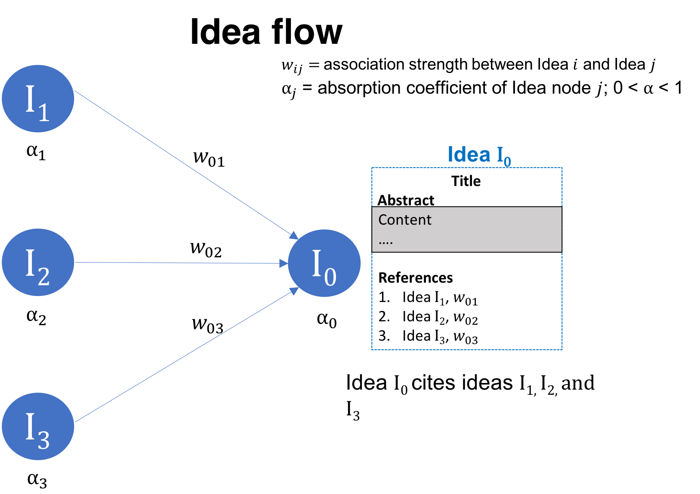
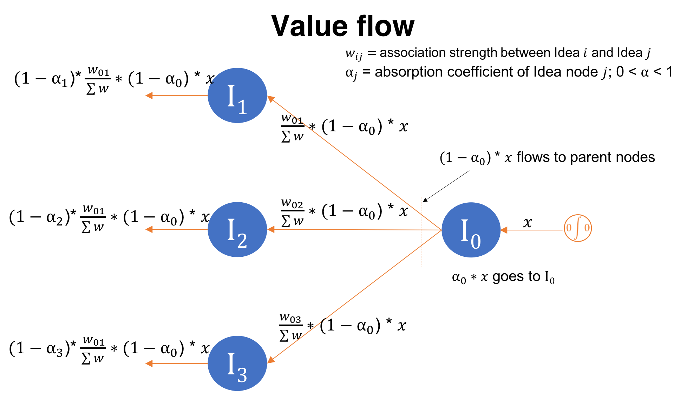

# Interplanetary Idea System (IPIS)

IPIS will be a protocol/model by virtue of which each unique idea can be identified and its evolution over the time can be tracked. In addition, it will give us a framework to evaluate the relationship between two different ideas. One way of modeling IPIS would be by a directed acyclic graph (DAG) that grows over time. The idea behind this model of IPIS is motivated by the Interplanetary File System (IPFS) (Baumgart & Mies, 2007) and the IOTA tangle (Popov, 2016). Each node of the DAG will be an IPIS object representing a unique idea.  An IPIS object will contain all the information required to represent a unique idea. If there is a publication or data (stored as an IPFS object) related to an idea, its IPIS object will contain the cryptographic hash of the IPFS object. 

IPIS will allow us to track the evolution of ideas over time as well as quantify the similarity of two ideas. The similarity score can be a hybrid of the market-driven score (decided by the scientific community via voting) and the algorithmic score generated from the IPIS protocol. IPIS will facilitate the efficient sharing of the ideas and prevent the community from reinventing wheels, thereby accelerating the pace of the scientific research. In addition, a good visualization of IPIS objects will help the scientific community to identify the pain points of scientific research. Similarly, it can be used to find the optimal distribution of available resources (e.g. fund allocation) required in order to maximize scientific throughput. Loosely speaking, IPIS will store the collective thought process of the whole scientific community.

### Mathematical Definition
Mathematically, IPIS is a directed acyclic graph (DAG) that grown over time. Each node in IPIS contains enough information to describe a unique idea I. The edge between two nodes representing ideas I1 and I2 will show the relationship (magnitude and direction of idea/information flow) between I1 and I2.

### Idea Flow

### Value Flow

## IPIS v.0.0 (basic version)
*we will implement this first*

Each node of IPIS will represent a publication and an edge will represent the direction of “idea flow”; the strength of relationship (or magnitude) is same for all idea pairs. This means first order “cost of idea” is same across the graph. However, it can be user dependent by design. For example, let’s say an entity publishes a publication A where publications B, C, D, & E are cited. In other words, the costs of idea of publications B, C, D, & E are equal for publication A. However, if the entity feels (and the reviewer agrees) that the publication A is more dependent on publications B & D, the entity can redistribute the costs of idea as (B, C, D, E) = (5, 1, 10, 1).

